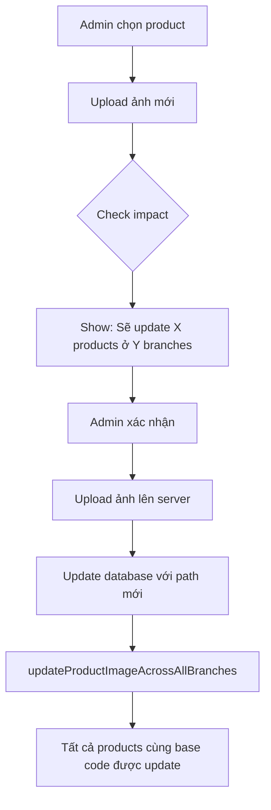

# Product & Banner Image Management

## Overview

Hệ thống AnEat quản lý hình ảnh cho Products và Banners với logic đặc biệt để đảm bảo tính nhất quán giữa các chi nhánh.

## Product Images

### Cấu trúc Product Code

Products được tổ chức theo chi nhánh với format code:
```
{BASE_CODE}-{BRANCH_CODE}
```

**Ví dụ:**
- `BURGER-001-HCM-Q1` - Burger Bò ở chi nhánh Quận 1
- `BURGER-001-HCM-Q3` - Burger Bò ở chi nhánh Quận 3  
- `BURGER-001-HCM-TD` - Burger Bò ở chi nhánh Thủ Đức

### Cơ chế Shared Images

**QUAN TRỌNG:** Khi admin upload/cập nhật hình ảnh cho một product, hình ảnh sẽ được **tự động cập nhật cho tất cả products cùng base code** ở các chi nhánh khác.

#### Tại sao?

- Cùng một món ăn (ví dụ: Burger Bò Phô Mai) có cùng hình ảnh ở tất cả chi nhánh
- Admin chỉ cần upload ảnh một lần, không cần upload riêng cho từng chi nhánh
- Đảm bảo tính nhất quán về branding và presentation

### API Service: product-image.service.ts

#### 1. Update Image Across All Branches

```typescript
import { updateProductImageAcrossAllBranches } from '@/models/product-image.service';

// Khi admin upload ảnh cho bất kỳ product nào
const updatedCount = await updateProductImageAcrossAllBranches(
  productId,      // ID của product được chọn
  '/assets/new-burger-image.webp'  // Đường dẫn ảnh mới
);

// Kết quả: Tất cả products cùng base code được update
// Ví dụ: Update BURGER-001-HCM-Q1 sẽ tự động update:
//   - BURGER-001-HCM-Q3
//   - BURGER-001-HCM-TD
```

#### 2. Extract Base Code

```typescript
import { extractBaseCode } from '@/models/product-image.service';

const baseCode = extractBaseCode('BURGER-001-HCM-Q1');
// Kết quả: "BURGER-001"
```

#### 3. Check Update Impact

```typescript
import { checkImageUpdateImpact } from '@/models/product-image.service';

const impact = await checkImageUpdateImpact(productId);
console.log(impact);
// {
//   baseCode: "BURGER-001",
//   affectedBranchesCount: 3,
//   affectedBranches: [
//     { branchName: "AnEat Quận 1", productCode: "BURGER-001-HCM-Q1", ... },
//     { branchName: "AnEat Quận 3", productCode: "BURGER-001-HCM-Q3", ... },
//     { branchName: "AnEat Thủ Đức", productCode: "BURGER-001-HCM-TD", ... }
//   ]
// }
```

#### 4. Update by Base Code Directly

```typescript
import { updateProductImageByBaseCode } from '@/models/product-image.service';

// Update tất cả products với base code cụ thể
const updatedCount = await updateProductImageByBaseCode(
  'BURGER-001',
  '/assets/new-image.webp'
);
```

#### 5. Get All Products by Base Code

```typescript
import { getProductsByBaseCode } from '@/models/product-image.service';

const products = await getProductsByBaseCode('BURGER-001-HCM-Q1');
// Trả về tất cả products với base code "BURGER-001" từ tất cả branches
```

## Banner Images

### Cơ chế Global Banners

**QUAN TRỌNG:** Banners là **GLOBAL** - không phân theo chi nhánh.

- Một banner được hiển thị cho **TẤT CẢ** customers ở **TẤT CẢ** chi nhánh
- Khi admin upload/cập nhật banner, thay đổi áp dụng ngay lập tức cho toàn hệ thống
- Không có banner riêng cho từng chi nhánh

### Why Global Banners?

✅ **Ưu điểm:**
- Chiến dịch marketing thống nhất toàn quốc
- Quản lý đơn giản - chỉ cần upload một lần
- Branding nhất quán
- Tiết kiệm storage và bandwidth

⚠️ **Lưu ý:**
- Không thể có banner khác nhau giữa các chi nhánh
- Nếu cần tính năng này trong tương lai, cần thêm `branchId` vào Banner model

### API Service: banner.service.ts

Service đã có sẵn với các methods:

```typescript
// Lấy tất cả banners đang active
const activeBanners = await BannerService.getActiveBanners();

// Tạo banner mới
const newBanner = await BannerService.createBanner({
  imageUrl: '/assets/new-banner.jpg',
  title: 'KHUYẾN MÃI MỚI',
  description: 'Giảm 50% tất cả combo',
  badge: 'HOT',
  displayOrder: 0,
  isActive: true
});

// Update banner
await BannerService.updateBanner(bannerId, {
  imageUrl: '/assets/updated-banner.jpg'
});

// Toggle active status
await BannerService.toggleBannerStatus(bannerId);
```

## Image Storage

### Frontend Public Assets

Tất cả hình ảnh được lưu trong:
```
frontend/public/assets/
```

### Image Path Format

- **Products:** `/assets/{product-image-name}.{ext}`
- **Banners:** `/assets/{banner-image-name}.{ext}`
- **Categories:** `/images/categories/{category-name}.jpg`

**Supported formats:**
- `.webp` (preferred - smaller size, better performance)
- `.png`
- `.jpg`
- `.jpeg`

## Seed Data

### Image Mapping Helper

File `seed.ts` có helper function để tự động map tên sản phẩm với ảnh:

```typescript
function getProductImagePath(productName: string, category: string): string {
  // Tự động tìm ảnh phù hợp dựa trên tên sản phẩm và category
  // Ví dụ:
  // - "Burger Bò Phô Mai" -> "/assets/cheese-burger.png"
  // - "Gà Rán" -> "/assets/fried-chicken-.jpg"
}
```

### Seed Behavior

Khi chạy `npm run prisma:seed`:

1. **Cleanup** - Xóa sạch database (tránh conflict)
2. **Create branches** - Tạo 3 chi nhánh
3. **Create products** - Mỗi product được tạo cho cả 3 branches với:
   - Unique code: `{BASE_CODE}-{BRANCH_CODE}`
   - **Same image path** cho tất cả branches cùng base code

**Kết quả:**
```
BURGER-001-HCM-Q1: image = /assets/cheese-burger.png
BURGER-001-HCM-Q3: image = /assets/cheese-burger.png
BURGER-001-HCM-TD: image = /assets/cheese-burger.png
```

## Admin Upload Flow

### Recommended Flow



### Implementation Example

```typescript
// In admin product controller
async function handleProductImageUpload(req, res) {
  const { productId } = req.params;
  const uploadedFile = req.file;
  
  try {
    // 1. Check impact trước
    const impact = await checkImageUpdateImpact(productId);
    
    // 2. Upload file lên storage
    const newImagePath = await uploadImage(uploadedFile);
    
    // 3. Update tất cả products
    const updatedCount = await updateProductImageAcrossAllBranches(
      productId,
      newImagePath
    );
    
    res.json({
      success: true,
      message: `Updated ${updatedCount} products across ${impact.affectedBranchesCount} branches`,
      affectedBranches: impact.affectedBranches
    });
  } catch (error) {
    res.status(500).json({ error: error.message });
  }
}
```

## Testing

### Test Image Update

```bash
# 1. Run seed to populate products
npm run prisma:seed

# 2. Test update function
cd prisma/archive/utilities
npx ts-node update-product-images.ts
```

### Verify Results

```sql
-- Check products với cùng base code có cùng image
SELECT 
  code,
  name,
  image,
  branchId
FROM "Product"
WHERE code LIKE 'BURGER-001%'
ORDER BY code;

-- Should return 3 rows with same image path
```

## Migration Guide

Nếu cần thêm tính năng **branch-specific images** trong tương lai:

### Option 1: Add Branch-Specific Image Field

```prisma
model Product {
  // ... existing fields
  image           String?  // Global/template image
  branchImage     String?  // Branch-specific override (optional)
}
```

### Option 2: Separate Template Model

```prisma
model ProductTemplate {
  id          String @id @default(cuid())
  baseCode    String @unique
  name        String
  image       String
  description String?
  products    Product[]
}

model Product {
  // ... existing fields
  templateId  String?
  template    ProductTemplate? @relation(...)
  // Use template.image if product.image is null
}
```

## Best Practices

✅ **DOs:**
- Upload images ở định dạng `.webp` để optimize performance
- Sử dụng meaningful filenames (e.g., `burger-bo-pho-mai.webp`)
- Compress images trước khi upload
- Check impact trước khi update images
- Show confirmation cho admin về số branches bị ảnh hưởng

❌ **DON'Ts:**
- Không upload ảnh quá lớn (> 500KB)
- Không dùng special characters trong filename
- Không update image trực tiếp qua SQL mà không qua service
- Không assume rằng product chỉ có ở 1 branch

## Troubleshooting

### Images không hiển thị?

1. Check đường dẫn: `/assets/...` (không phải `/images/...`)
2. Verify file tồn tại trong `frontend/public/assets/`
3. Check browser console cho 404 errors

### Update chỉ ảnh hưởng 1 branch?

1. Check product code format: phải có `{BASE}-{BRANCH}`
2. Verify đang dùng `updateProductImageAcrossAllBranches()`
3. Check `extractBaseCode()` function logic

### New images không có trong seed?

1. Add vào `getProductImagePath()` helper
2. Upload ảnh vào `frontend/public/assets/`
3. Re-run seed: `npm run prisma:seed`
