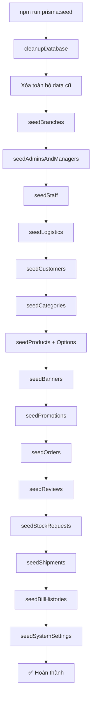

# 🌱 Seed Data - Hướng Dẫn Hoàn Chỉnh

## 📋 Tổng Quan

File `prisma/seed.ts` là **file seed chính duy nhất** của hệ thống, chứa toàn bộ dữ liệu mẫu chuẩn cho demo. Khi chạy seed, hệ thống sẽ **tự động xóa toàn bộ dữ liệu cũ** và tạo lại từ đầu.

## 🎯 Mục Đích

- ✅ Khôi phục dữ liệu mẫu khi lỡ xóa trong quá trình dev
- ✅ Reset database về trạng thái ban đầu
- ✅ Tạo dữ liệu demo đầy đủ cho tất cả tính năng
- ✅ Đảm bảo tính nhất quán giữa các môi trường

## 🚀 Cách Sử Dụng

### Chạy Seed

```bash
cd backend
npm run prisma:seed
```

### Kết Quả

```
✅ All seeds completed successfully!

📊 Summary:
   Branches:        3
   Managers:        3
   Staff:           9
   Logistics:       5
   Customers:       5
   Categories:      7
   Products:        75 (across all branches with images)
   Product Options: 315 (customization options)
   Promotions:      3
   Orders:          32 (with varied statuses & promotions)
   Reviews:         13
   Stock Requests:  15
   Shipments:       13
   Bill Histories:  8
   System Settings: 15
```

## 📦 Dữ Liệu Được Tạo

### 1. **Branches (Chi Nhánh)** - 3 branches
```typescript
- AnEat Quận 1 (HCM-Q1)
- AnEat Quận 3 (HCM-Q3)
- AnEat Thủ Đức (HCM-TD)
```

### 2. **Users (Người Dùng)** - 17 users

#### Admin System (1):
- `admin@aneat.com` / `admin123`

#### Managers (3):
- `manager.q1@aneat.com` / `manager123` (Quản lý Quận 1)
- `manager.q3@aneat.com` / `manager123` (Quản lý Quận 3)
- `manager.td@aneat.com` / `manager123` (Quản lý Thủ Đức)

#### Staff (9):
- `staff.q1.01-03@aneat.com` / `staff123` (3 staff Quận 1)
- `staff.q3.01-03@aneat.com` / `staff123` (3 staff Quận 3)
- `staff.td.01-03@aneat.com` / `staff123` (3 staff Thủ Đức)

#### Logistics (5):
- `logistics01-05@aneat.com` / `logistics123`

### 3. **Customers (Khách Hàng)** - 5 customers
```typescript
- customer01@gmail.com (Khách Hàng A)
- customer02@gmail.com (Khách Hàng B)
- customer03@gmail.com (Khách Hàng C)
- customer04@gmail.com (Khách Hàng D)
- customer05@gmail.com (Khách Hàng E)
```

### 4. **Categories (Danh Mục)** - 7 categories

Từ `prisma/archive/newdata.md`:
```typescript
1. MON_NGON_PHAI_THU - Món ngon phải thử (Combos)
2. GA_GION_VUI_VE - Gà giòn vui vẻ (Fried Chicken)
3. MY_Y - Mỳ ý (Pasta)
4. BURGER - Burger
5. PHAN_AN_PHU - Phần ăn phụ (Sides)
6. TRANG_MIENG - Tráng miệng (Desserts)
7. THUC_UONG - Thức uống (Drinks)
```

### 5. **Products (Sản Phẩm)** - 75 products (25 base × 3 branches)

#### Base Products (25):

**Combos (3):**
- COMBO-001: COMBO MỘT MÌNH ĂN NGON - 78,000đ
- COMBO-002: CẶP ĐÔI ĂN Ý - 145,500đ
- COMBO-003: CẢ NHÀ NO NÊ - 185,000đ

**Chicken (4):**
- CHICKEN-001: 2 MIẾNG GÀ - 66,000đ
- CHICKEN-002: 4 MIẾNG GÀ - 126,000đ
- CHICKEN-003: 2 GÀ + KHOAI + NƯỚC - 91,000đ
- CHICKEN-004: 1 GÀ + KHOAI + NƯỚC - 58,000đ

**Pasta (3):**
- PASTA-001: MÌ Ý SỐT CAY VỪA - 40,000đ
- PASTA-002: 1 MÌ + 1 NƯỚC - 50,000đ
- PASTA-003: 1 MÌ + 1 GÀ + 1 NƯỚC - 83,000đ

**Burger (3):**
- BURGER-001: BURGER TÔM + KHOAI + NƯỚC - 65,000đ
- BURGER-002: BURGER TÔM + NƯỚC - 50,000đ
- BURGER-003: BURGER TÔM - 40,000đ

**Sides (4):**
- SIDE-001: KHOAI TÂY CHIÊN VỪA - 20,000đ
- SIDE-002: KHOAI TÂY CHIÊN LẮC BBQ VỪA - 25,000đ
- SIDE-003: KHOAI TÂY CHIÊN LỚN - 25,000đ
- SIDE-004: KHOAI TÂY CHIÊN LẮC BBQ LỚN - 35,000đ

**Desserts (3):**
- DESSERT-001: KEM VANI (CÚP) - 5,000đ
- DESSERT-002: KEM SOCOLA (CÚP) - 7,000đ
- DESSERT-003: KEM SUNDAE DÂU - 15,000đ

**Drinks (5):**
- DRINK-001: TRÀ CHANH HẠT CHIA - 20,000đ
- DRINK-002: PEPSI VỪA - 12,000đ
- DRINK-003: 7UP VỪA - 12,000đ
- DRINK-004: PEPSI LỚN - 17,000đ
- DRINK-005: 7UP LỚN - 17,000đ

### 6. **Product Options (Tùy Chọn Sản Phẩm)** - 315 options

#### Ví Dụ Options cho COMBO-001:

```typescript
// Chọn Gà (required)
- 1 Miếng Gà Giòn (+0đ)
- Miếng Gà Sốt Cay (+0đ)

// Chọn Mì (required)
- Mì Ý (Up) (+10,000đ)
- Mì Ý Sốt Cay Vừa (+15,000đ)
- Mì Ý Sốt Cay (Up) (+20,000đ)

// Nước Ngọt (required)
- 7Up Thường (+0đ)
- 7Up Up (+10,000đ)
- Pepsi Thường (+0đ)
- Pepsi Up (+10,000đ)
```

#### Option Types:
- `CHICKEN`: Chọn loại gà (giòn/cay)
- `PASTA`: Chọn loại/size mì
- `SIDE`: Chọn loại/size khoai tây
- `DRINK`: Chọn loại/size nước uống

### 7. **Promotions (Khuyến Mãi)** - 3 promotions

```typescript
1. COMBO50K - Giảm 50,000đ (cho đơn từ 200,000đ)
2. SALE20 - Giảm 20% (cho đơn từ 100,000đ)
3. SALE30 - Giảm 30% (cho đơn từ 250,000đ)
```

### 8. **Orders (Đơn Hàng)** - ~40 orders

Các trạng thái:
- `PENDING`: Chờ xử lý
- `PREPARING`: Đang chuẩn bị
- `READY`: Sẵn sàng giao
- `COMPLETED`: Hoàn thành
- `CANCELLED`: Đã hủy

### 9. **Reviews (Đánh Giá)** - ~14 reviews

Rating từ 3-5 sao với comments mẫu

### 10. **Banners** - 3 banners

```typescript
1. "NỞ CÀNG BỤNG VUI BẤT MOOD" - Badge: HOT
2. "BURGER PHÔ MAI MỚI" - Badge: MỚI
3. "MỲ Ý THƯỢNG HẠNG" - No badge
```

### 11. **Stock Requests (Yêu Cầu Nhập Kho)** - ~15 requests

```typescript
Types: RESTOCK, ADJUSTMENT, RETURN
Status: PENDING, APPROVED, COMPLETED, REJECTED

Ví dụ:
- SR-xxx-xxx: RESTOCK - 50 units Gà Rán - APPROVED
- SR-xxx-xxx: ADJUSTMENT - 20 units Burger - COMPLETED
- SR-xxx-xxx: RETURN - 10 units Khoai Tây - REJECTED
```

### 12. **Shipments (Vận Chuyển)** - ~13 shipments

```typescript
Status: READY, IN_TRANSIT, DELIVERED, COMPLETED
From: Kho Trung Tâm TP.HCM
To: Chi nhánh các quận

Ví dụ:
- SHIP-xxx-xxx: Gà Rán Giòn - 30 units - IN_TRANSIT
- SHIP-xxx-xxx: Burger Bò - 50 units - COMPLETED
- SHIP-xxx-xxx: Nước Ngọt - 100 units - DELIVERED
```

### 13. **Bill Histories (Lịch Sử Hóa Đơn)** - ~8 histories

```typescript
Tracking changes to bills:
- Version 1: Initial version (created)
- Version 2: Updated payment information
- Fields tracked: paymentStatus, paidAmount, etc.
```

### 14. **System Settings (Cấu Hình Hệ Thống)** - 15 settings

```typescript
Categories: general, contact, business, about

General:
- store_name: "AnEat - Gà Rán & Burger"
- store_slogan: "Ngon - Rẻ - Sạch"

Contact:
- hotline: "1900 1234"
- email_support: "support@aneat.com"
- facebook_url: "https://facebook.com/aneat.vn"
- instagram_url: "https://instagram.com/aneat.vn"

Business:
- opening_hours: "08:00 - 22:00"
- delivery_fee: "15000" (VND)
- min_order_amount: "50000" (VND)
- free_delivery_threshold: "200000" (VND)
- tax_rate: "10" (%) [Internal]
- points_per_1k: "1" [Internal]

About:
- about_intro: "AnEat là chuỗi cửa hàng..."
- mission: "Mang đến món ăn nhanh..."
- vision: "Trở thành chuỗi gà rán số 1..."
```

## 🗂️ Cấu Trúc File

### File Chính

```
backend/
  prisma/
    seed.ts              ← FILE SEED CHÍNH (DUY NHẤT)
    schema.prisma        ← Database schema
```

### Files Tham Khảo (Archive)

```
backend/
  prisma/
    archive/
      newdata.md                    ← Nguồn dữ liệu products
      cleanup-categories.ts         ← Nguồn dữ liệu categories
      image-mapping.ts              ← Logic map ảnh products
      utilities/                    ← Các utility scripts
```

## 🔄 Workflow Seed



## 📸 Image Mapping

### Cách Hoạt Động

Seed tự động tìm và map ảnh từ `frontend/public/assets`:

```typescript
function getProductImage(productName: string): string {
  // 1. Normalize tên sản phẩm (bỏ dấu, lowercase)
  // 2. Tìm file ảnh trong /assets (.webp, .png, .jpg)
  // 3. Tính điểm khớp (0-100)
  // 4. Chọn ảnh có điểm cao nhất
  // 5. Fallback: /assets/default-product.jpg
}
```

### Ví Dụ

```
Product: "BURGER TÔM"
→ Normalize: "burger-tom"
→ Tìm: /assets/1-burger-tom.webp
→ Match score: 100
→ Result: /assets/1-burger-tom.webp
```

## 🎛️ Product Options Mapping

Options được định nghĩa trong `productOptionsMap`:

```typescript
const productOptionsMap: { [productCode: string]: ProductOptionData[] } = {
  'COMBO-001': [
    { name: 'Chọn Gà: 1 Miếng Gà Giòn', price: 0, type: 'CHICKEN', order: 1 },
    { name: 'Chọn Mì: Mì Ý (Up)', price: 10000, type: 'PASTA', order: 3 },
    // ...
  ],
  // ...
}
```

Mỗi product được tạo với options tương ứng từ map này.

## ⚙️ Cleanup Logic

### Thứ Tự Xóa (quan trọng vì Foreign Keys):

```typescript
1. billHistory        ← child of bill
2. bill              ← child of order
3. orderItemOption   ← child of orderItem
4. orderItem         ← child of order
5. order             ← child of customer, branch
6. stockTransaction  ← child of product
7. stockRequest      ← child of product
8. productOption     ← child of product
9. inventory         ← child of product
10. product          ← child of category, branch
11. productCategory
12. review           ← child of customer, product
13. customer
14. promotion
15. banner
16. user             ← parent of orders, branches
17. branch
18. systemSetting
```

## 📝 Test Credentials

```bash
# Admin System
Email: admin@aneat.com
Password: admin123

# Manager Quận 1
Email: manager.q1@aneat.com
Password: manager123

# Staff Quận 1
Email: staff.q1.01@aneat.com
Password: staff123

# Logistics
Email: logistics01@aneat.com
Password: logistics123
```

## 🛡️ Best Practices

### ✅ Nên:
- Chạy seed khi database bị lỗi
- Dùng seed để reset về trạng thái mặc định
- Thêm dữ liệu mới vào `baseProducts` array
- Update `productOptionsMap` khi thêm options mới

### ❌ Không nên:
- Tạo file seed riêng cho từng bảng
- Sửa trực tiếp database mà không update seed
- Xóa thủ công data thay vì chạy seed lại
- Tạo nhiều file seed gây conflict

## 🔧 Troubleshooting

### Lỗi: Foreign Key Constraint

**Nguyên nhân**: Xóa không đúng thứ tự

**Giải pháp**: Kiểm tra thứ tự trong `cleanupDatabase()`

### Lỗi: Image Not Found

**Nguyên nhân**: Thiếu file ảnh trong `/assets`

**Giải pháp**: 
```bash
# Check ảnh có tồn tại
ls frontend/public/assets/*.webp

# Thêm ảnh mới vào folder assets
```

### Lỗi: Duplicate Key

**Nguyên nhân**: Product code bị trùng

**Giải pháp**: Kiểm tra `baseProducts` array, đảm bảo code unique

### Seed Chạy Lâu

**Nguyên nhân**: Tạo quá nhiều options/orders

**Giải pháp**: 
- Giảm số lượng orders trong loop
- Giảm số lượng product options

## 📊 Performance

```
Thời gian seed trung bình: ~5-8 giây

Breakdown:
- Cleanup: ~1s
- Users & Branches: ~1s
- Categories: ~0.5s
- Products + Options: ~2-3s (315 options)
- Orders: ~1-2s
- Reviews: ~0.5s
```

## 🚀 Nâng Cấp Tương Lai

### Có thể thêm:
- [ ] Stock transactions mẫu
- [ ] Bill histories đầy đủ
- [ ] Shipment data
- [ ] Inventory thresholds
- [ ] Customer tiers với points
- [ ] More product options (sizes, toppings)
- [ ] System settings mặc định

## 📚 Tài Liệu Liên Quan

- [IMAGE_MANAGEMENT.md](./IMAGE_MANAGEMENT.md) - Quản lý hình ảnh
- [DEPLOYMENT_SUMMARY.md](./DEPLOYMENT_SUMMARY.md) - Deploy production
- [API_GUIDELINES.md](./API_GUIDLINES.md) - API conventions

---

## 🎉 Kết Luận

File `seed.ts` là **single source of truth** cho dữ liệu mẫu của hệ thống. Mọi thay đổi về data demo phải được cập nhật vào file này để đảm bảo tính nhất quán khi dev hoặc deploy.

**Khi nào cần chạy seed?**
- ✅ Sau khi clone project lần đầu
- ✅ Khi database bị lỗi/corrupt
- ✅ Khi cần reset về trạng thái ban đầu
- ✅ Trước khi demo cho khách hàng
- ✅ Sau khi migrate schema

**Lưu ý**: Seed sẽ **XÓA TOÀN BỘ** dữ liệu hiện tại!
